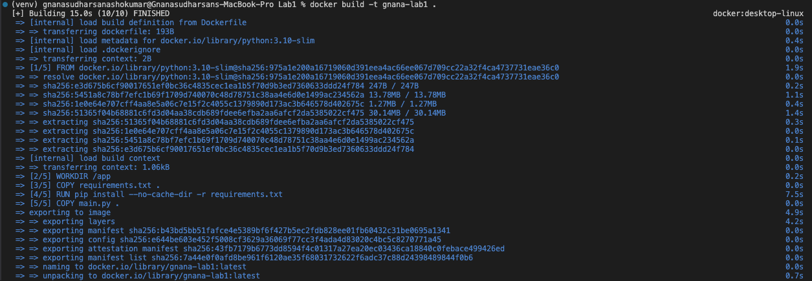
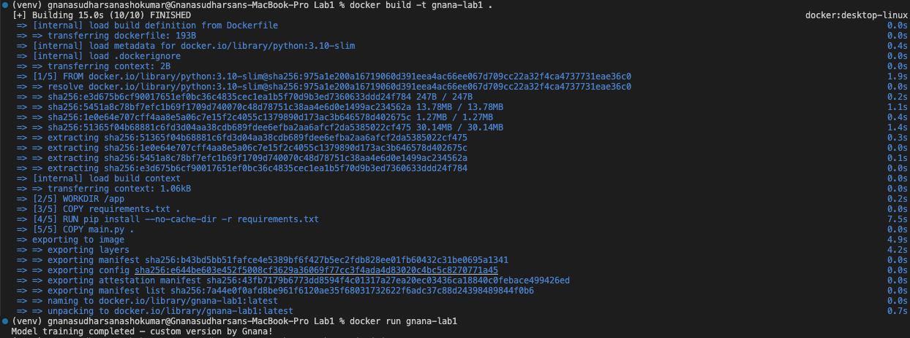
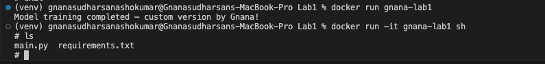
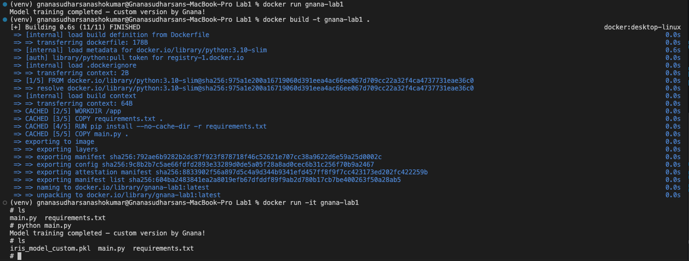

# Docker Lab
```bash
	•	Added a manual shuffle to the dataset using NumPy
	•	Modified train-test split random state
	•	Increased RandomForestClassifier estimators from 100 → 150
	•	Added max_depth=5 to the model
	•	Saved model as iris_model_custom.pkl
	•	Wrote a custom Dockerfile
	•	Added a requirements.txt for dependency control
	•	Ran the entire ML pipeline inside Docker
```
---

### Files in This Repository
```bash
Dockerfile          # The Docker build instructions
main.py             # Modified ML training script
requirements.txt    # Dependencies installed inside container
src/                # Extra folder (not used but kept from original structure)
venv/               # Local virtual environment (ignored by Docker)

```
---

### How to Build the Docker Image

 ``` bash
docker build -t gnana-lab1 .

```
---

### How to Run the Docker Container
 ``` bash
docker run gnana-lab1
 ``` 
Expected output:

Model training completed — custom version by Gnana!


---
## Screenshots

### Docker Build Success


### Docker Build (Second View)


### Docker Run Output


### Files Inside Container



---
### Summary
 ``` bash
This lab demonstrates how to:
	•	Containerize a machine learning script
	•	Install dependencies inside a Docker image
	•	Run a modified Python ML workflow
	•	Produce reproducible results inside a container
 ``` 

